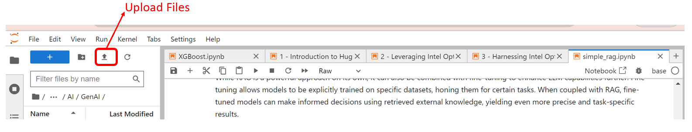

# Video Question Answering and Summarization using Gen AI LLMs on Intel Xeon Scalable Processors

This article explores how Generative AI and Large Language Models (LLMs) can be applied for video question answering and summarization on Intel Xeon Scalable Processors. It demonstrates the process of extracting insights from video content by leveraging advanced AI techniques to handle both audio and visual data. The solution efficiently uses Xeon processors to deliver video analysis, providing meaningful responses to questions and generating summaries, enabling faster decision-making and improved productivity in industries like law enforcement, media, and more.

We will use an M7i.8xlarge EC2 instance in AWS to run the test. The instance is based on the 4th generation of Intel Xeon Scalable processors called Sapphire Rapids.

## Pre-requisites
- Access to an AWS account and privilege to setup EC2 instances
- Knowledge of setting up EC2 instances
- Basic familiarity with running CLI commands, SSH, and running Jupyter notebook

### Step-01

Launch an EC2 instance from AWS Console. Select US-East-1 region, since it is likely to have better availability in that region. Specs for the EC2 instance as follows.

> M7i.8xlrage
>
> Ubuntu 24.04
>
> 300 GB disk storage
>
> Enable public IP
>
> Inside your existing VPC or default VPC
>
> Create a key pair or use your existing key pair
>
> Create a security group or use your existing security group. Inbound rules needed for security group are:
>> open port 22 for SSH from your desired IP address
>>
>> open port 8888 for connecting to jupyter notebook from your desired IP address
>
> Wait until the EC2 instance is fully launched and ready

### Step-02
Log into the EC2 instance via SSH. You will need the EC2 key that you created or reused in the earlier step. Since the OS is ubuntu 24.04, your ssh login username will be ubuntu.

You can use your favorite SSH clients like putty or bitvise or even log in from your command line.

Once logged in you will be at the directory `/home/ubuntu`

### Step-03
Run the following commands.

Update the OS

```
sudo apt-get update
```

```
sudo apt-get upgrade -y
```

Install pip

```
sudo apt-get install python3-pip
```

Install Python virtual environment

```
sudo apt-get install python3-venv
```

Create a virtual environment called test

```
python3 -m venv test
```

Activate the virtual environment

```
source test/bin/activate
```

Install Jupyterlab

```
pip3 install jupyterlab jupyter
```

Generate Jupyter notebook configuration file

```
jupyter notebook --generate-config
```

> note the path to the configuration file is /home/ubuntu/jupyter/jupyter_notebook_config.py

Create Jupyter notebook password

```
jupyter notebook password
```
>
> you enter the password of your choice. You will need to re-enter the password to confirm

### Step-04
From the command line within the EC2 instance, from your SSH session, type the command below to start the Jupyter server.

```
jupyter-lab --ip 0.0.0.0 --no-browser --allow-root
```

The command `jupyter-lab --ip 0.0.0.0 --no-browser --allow-root` launches a Jupyter Lab server. It also configures the server to be accessible from any IP address **(--ip 0.0.0.0)**, disables launching a web browser **(--no-browser)**, and allows it to run as the root user **(--allow-root)**.

Do not press control + C, keep this running, so that you can access the Jupyter notebook from your web browser.

### Step-05
Access the Jupyter notebook and run the instructions within the notebook.

Open your favorite browser, like Chrome or something you use. On the address bar line type the following link and press `Enter` key.
`http://Public_IP:8888`, where **Public_IP** is the public IP address of your EC2 instance. You can get the public IP address from the AWS console or CLI

Once the Jupyter notebook opens, give the password you set befor. This will bring you into the Jupyter notebook environment.

### Step-06
Once in the Jupyter notebook environment, click the upload files icon and upload the notebook `.ipynb` file. Name of the file is `Video_QnA_with_Gen_AI_Visual_Inference_Xeon.ipynb`. The screen shot below show the location of the upload files icon. This Jupyter notebook is present in this Github repo.



### Step-07.A
We need to upload the video file we will be using for this test. This is intended for short video clips between 50 seconds to 80 seconds. The solution can be extended to longer videp clips by breaking down the video clips into smaller video clips or using an AI accelerator like Intel Gaudi for faster processing of inferences.

Upload your video clip, let's say `your_video.mp4` using the **upload icon** described above. In this test, we have used `mp4` video format. If you use other video formats, you may ned to add additional processing steps.

### Step-07.B
Double click the `Video_QnA_with_Gen_AI_Visual_Inference_Xeon.ipynb` file on the left hand tree of the Jupyter notebook. This will launch the notebook. Read the documentation and run through the notebook cells to go over the test step by step.

## Optimizing the LLM model with Optimum[OpenVINO]
**Optimum[openvino]** is an extension of the Hugging Face Optimum library specifically designed to work with Intel's OpenVINO toolkit. This integration allows developers to optimize and accelerate the inference of machine learning models, particularly those from the Hugging Face model hub, on Intel hardware, including CPUs, GPUs, and AI accelerators.

By using **Optimum[openvino]**, you can easily load pre-trained models, apply performance optimizations like quantization (e.g., BF16), and run these models efficiently on Intel architectures. This is especially useful for deploying AI models in environments where performance and resource utilization are critical, such as in edge computing or production scenarios where inference speed and efficiency are paramount.

In this repository, we demonstrate how to download the `EleutherAI/gpt-neo-2.7B` model from Hugging Face, then use the OpenVINO toolkit to quantize it to BF16 precision. This LLM is being used to generate the final response from the frames of the video. BY optimizing with OpenVINO, we will demostrate how it improves the inferencing time.

We will use the same type of M7i.8xlarge EC2 instance in AWS to run the test. The instance is based on the 4th generation of Intel Xeon Scalable processors called Sapphire Rapids. We recommend running the OpenVINO test on a separate EC2 instance to keep your test environments isolated for ease of comparison of results.

### Step-01

Launch another EC2 instance from AWS Console. Select US-East-1 region, since it is likely to have better availability in that region. Specs for the EC2 instance as follows.

> M7i.8xlrage
>
> Ubuntu 24.04
>
> 300 GB disk storage
>
> Enable public IP
>
> Inside your existing VPC or default VPC
>
> Create a key pair or use your existing key pair
>
> Create a security group or use your existing security group. Inbound rules needed for security group are:
>> open port 22 for SSH from your desired IP address
>>
>> open port 8888 for connecting to jupyter notebook from your desired IP address
>
> Wait until the EC2 instance is fully launched and ready

### Step-02
Log into the EC2 instance via SSH. You will need the EC2 key that you created or reused in the earlier step. Since the OS is ubuntu 24.04, your ssh login username will be ubuntu.

You can use your favorite SSH clients like putty or bitvise or even log in from your command line.

Once logged in you will be at the directory `/home/ubuntu`

### Step-03
Run the following commands.

Update the OS

```
sudo apt-get update
```

```
sudo apt-get upgrade -y
```

Install pip

```
sudo apt-get install python3-pip
```

Install Python virtual environment

```
sudo apt-get install python3-venv
```

Create a virtual environment called test

```
python3 -m venv test
```

Activate the virtual environment

```
source test/bin/activate
```

Install Jupyterlab

```
pip3 install jupyterlab jupyter
```

Generate Jupyter notebook configuration file

```
jupyter notebook --generate-config
```

> note the path to the configuration file is /home/ubuntu/jupyter/jupyter_notebook_config.py

Create Jupyter notebook password

```
jupyter notebook password
```
>
> you enter the password of your choice. You will need to re-enter the password to confirm

### Step-04
From the command line within the EC2 instance, from your SSH session, type the command below to start the Jupyter server.

```
jupyter-lab --ip 0.0.0.0 --no-browser --allow-root
```

The command `jupyter-lab --ip 0.0.0.0 --no-browser --allow-root` launches a Jupyter Lab server. It also configures the server to be accessible from any IP address **(--ip 0.0.0.0)**, disables launching a web browser **(--no-browser)**, and allows it to run as the root user **(--allow-root)**.

Do not press control + C, keep this running, so that you can access the Jupyter notebook from your web browser.

### Step-05
Access the Jupyter notebook and run the instructions within the notebook.

Open your favorite browser, like Chrome or something you use. On the address bar line type the following link and press `Enter` key.
`http://Public_IP:8888`, where **Public_IP** is the public IP address of your EC2 instance. You can get the public IP address from the AWS console or CLI

Once the Jupyter notebook opens, give the password you set befor. This will bring you into the Jupyter notebook environment.

### Step-06
Once in the Jupyter notebook environment, click the upload files icon and upload the notebook `.ipynb` file. Name of the file is `Video_QnA_with_Gen_AI_Visual_Inference_Xeon-OpenVINO_Optimized.ipynb`. The screen shot below show the location of the upload files icon. This Jupyter notebook is present in this Github repo.


### Step-07.A
We need to upload the video file we will be using for this test. This is intended for short video clips between 50 seconds to 80 seconds. The solution can be extended to longer videp clips by breaking down the video clips into smaller video clips or using an AI accelerator like Intel Gaudi for faster processing of inferences.

Upload your video clip, let's say `your_video.mp4` using the **upload icon** described above. In this test, we have used `mp4` video format. If you use other video formats, you may ned to add additional processing steps.

### Step-07.B
Double click the `Video_QnA_with_Gen_AI_Visual_Inference_Xeon-OpenVINO_Optimized.ipynb` file on the left hand tree of the Jupyter notebook. This will launch the notebook. Read the documentation and run through the notebook cells to go over the test step by step.

## Comparison of final response time of EleutherAI/gpt-neo-2.7B LLM with and without using OpenVINO
| Steps                             | Without OpenVINO (seconds) | With OpenVINO (seconds) |
|------------------------------------|----------------------|-------------------|
| query_frames time                  | 19.95151             | 21.50149          |
| combine_answers time               | 0.00006              | 0.00005           |
| refine_response_with_gpt_neo time  | 3.34291              | 1.90453           |

We can see, that using OpenVINO, we are seeing **approx 43%** improvement in response time

## Destroy Resources in AWS
At the end of the testing, please remember to destroy or terminate your resources in AWS to avoid aditional billing.

## Next Steps

- We encourage you to try out the testing in your own environment to run LLM inferencing on Xeon for video question answering on Xeon using OpenVINO.

